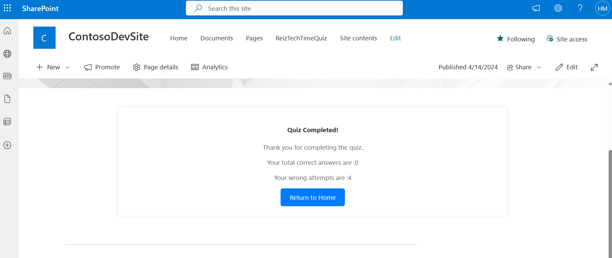

# reiz-tech-prj

## Summary
This is a SPFx WebPart that gets information from the users and verifies it against public API TimeIO. Its format is a quiz type.Once the item is created in sharepoint the mail will automatically go the assigned user using PowerAutomate.

[,,,]

## Prerequisites

> Any special pre-requisites?
- install npm install 
- create sharepoint list with corresponding columns 

## Solution

| Solution    | Author(s)                                               |
| ----------- | ------------------------------------------------------- |
| ReizTechPrj | Hadi Mahmood

